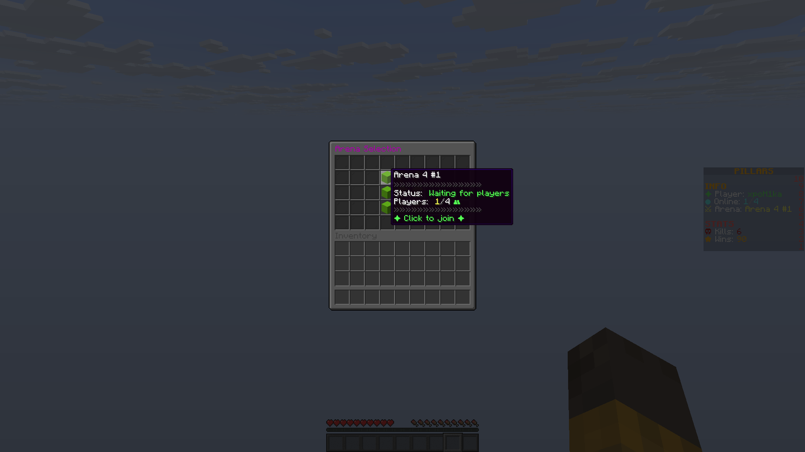
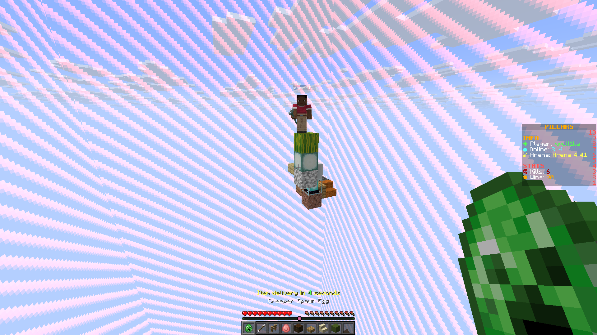
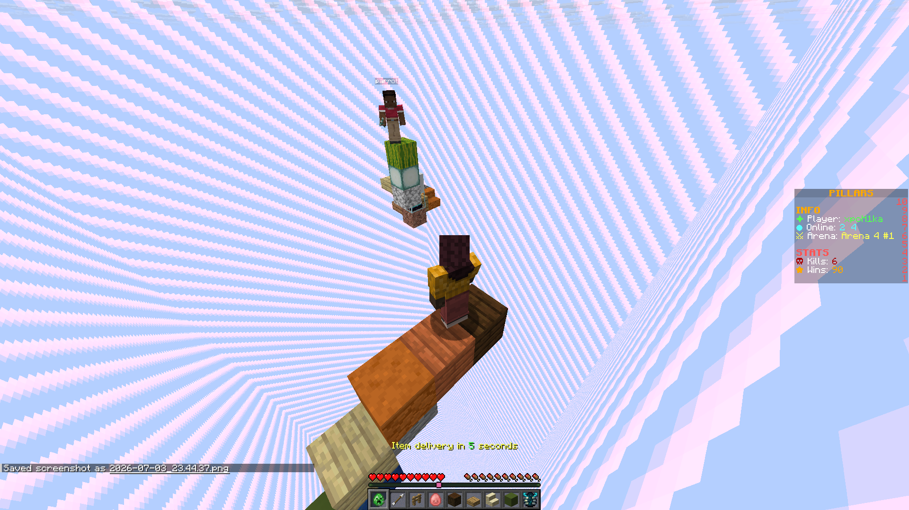
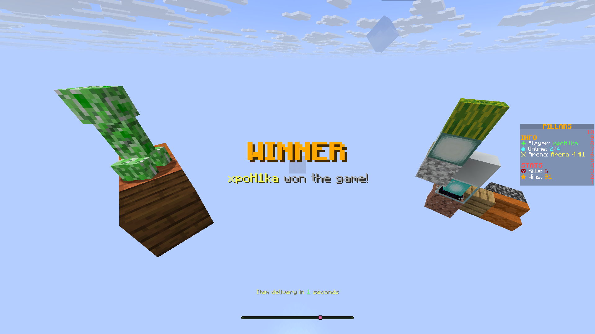

# PillarsPlugin

PillarsPlugin is a Paper Minecraft minigame plugin where players join pillar arenas, fight with randomized items, and earn persistent win/kill stats.

## Requirements

- Java 21
- Paper server compatible with API version `1.21`
- Maven, if building from source

## Building

```bash
mvn clean package
```

The built plugin jar is created in:

```text
target/pillarsplugin-1.0-SNAPSHOT.jar
```

Copy the jar into your server's `plugins` folder and restart the server.

## Commands

The main command is `/pillars`. The shorter alias `/p` is also available.

| Command | Description |
| --- | --- |
| `/p menu` | Opens the arena selection menu. |
| `/p join <arena>` | Joins a specific arena by config key, for example `/p join arena4_1`. |
| `/p leave` | Leaves the current game. |
| `/p forcestart` | Force starts the current game. Requires `pillars.forcestart`. |

## Permissions

| Permission | Default | Description |
| --- | --- | --- |
| `pillars.forcestart` | `op` | Allows a player to use `/p forcestart`. |

## Configuration

The plugin creates and reads its settings from:

```text
plugins/PillarsPlugin/config.yml
```

Most gameplay values can be configured in `config.yml`, including minimum players, countdowns, arena reset timing, border shrinking, item rarity, lobby world, arena worlds, spawn points, display names, and item cooldowns.

### Main Settings

```yaml
settings:
  minPlayers: 4
  beginCountdownSeconds: 5
  endGameLobbyCountdownSeconds: 5
  endGameSpectatorDelayTicks: 40
  arenaResetDelayTicks: 160
  borderShrinkSeconds: 300
  borderMinSize: 1
  lobbyWorldName: "world"
  witherCountdownSeconds: 5
  witherEffectDurationTicks: 40
  witherEffectPeriodTicks: 40
  witherEffectAmplifier: 1
  itemRarity:
    legendaryPercent: 5
    rarePercent: 15
```

| Setting | Description |
| --- | --- |
| `minPlayers` | Minimum number of players required before the game can start normally. |
| `beginCountdownSeconds` | Countdown duration before a game begins. |
| `endGameLobbyCountdownSeconds` | Countdown before players are sent back to the lobby after a game. |
| `endGameSpectatorDelayTicks` | Delay before end-game spectator handling, in ticks. 20 ticks is about 1 second. |
| `arenaResetDelayTicks` | Delay before the arena is reset, in ticks. |
| `borderShrinkSeconds` | Time before or during world border shrinking, in seconds. |
| `borderMinSize` | Minimum final border size. |
| `lobbyWorldName` | World name used as the lobby destination. |
| `witherCountdownSeconds` | Countdown related to the wither effect phase. |
| `witherEffectDurationTicks` | Wither effect duration, in ticks. |
| `witherEffectPeriodTicks` | How often the wither effect is applied, in ticks. |
| `witherEffectAmplifier` | Strength of the wither effect. |
| `itemRarity.legendaryPercent` | Chance percentage for legendary items. |
| `itemRarity.rarePercent` | Chance percentage for rare items. |

### Arenas

Arenas are configured under the `arenas` section. Each arena key, such as `arena4_1`, is also the value used by `/p join <arena>`.

Example:

```yaml
arenas:
  arena4_1:
    worldName: "arena4_1"
    spawnPoints:
      - [-6, 100, -6]
      - [-6, 100, 6]
      - [6, 100, -6]
      - [6, 100, 6]
    displayName: "Arena 4 #1"
    itemCooldownSeconds: 5
```

| Arena Field | Description |
| --- | --- |
| `worldName` | Name of the world used for this arena. |
| `spawnPoints` | Player spawn locations in `[x, y, z]` format. The number of spawn points controls the arena capacity. |
| `displayName` | Name shown to players in menus and messages. |
| `itemCooldownSeconds` | Cooldown between item grants or item usage for that arena. |

The default config includes:

| Arena Group | Arenas | Players |
| --- | --- | --- |
| 4-player arenas | `arena4_1`, `arena4_2`, `arena4_3` | 4 |
| 8-player arenas | `arena8_1`, `arena8_2`, `arena8_3` | 8 |
| 12-player arenas | `arena12_1`, `arena12_2`, `arena12_3` | 12 |

When adding a new arena, make sure the world exists on the server and that every spawn point is valid for that world.

## Player Stats

Player stats are saved automatically in:

```text
plugins/PillarsPlugin/stats.json
```

Stats are stored by player UUID. Each player record contains `kills` and `wins`.

Example:

```json
{
  "b744622a-89d2-3677-be4d-addfdb169e9e": {
    "kills": 6,
    "wins": 90
  },
  "0f1e2309-3ba3-3ba8-b90a-5b2a25b198f8": {
    "kills": 0,
    "wins": 2
  }
}
```

The plugin creates `stats.json` if it does not already exist.

## Screenshots

### Arena Menu



### Game In Progress




### Winner Screen



## Project Structure

```text
src/main/java/org/example/pillars
  command/       Command handling for /pillars and /p
  entities/      Arena and player stat models
  gui/           Arena menu GUI
  items/         Common, rare, and legendary items
  listeners/    Bukkit event listeners
  managers/     Game, arena, player, stats, HUD, item, spawn, sound, and teleport logic

src/main/resources
  config.yml     Default plugin configuration
  plugin.yml     Plugin metadata, commands, aliases, and permissions
```
