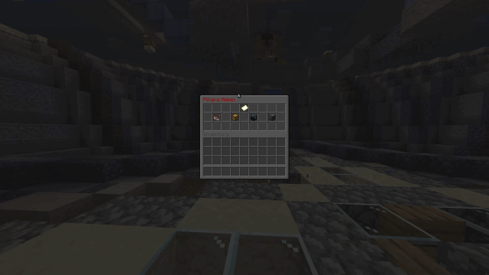
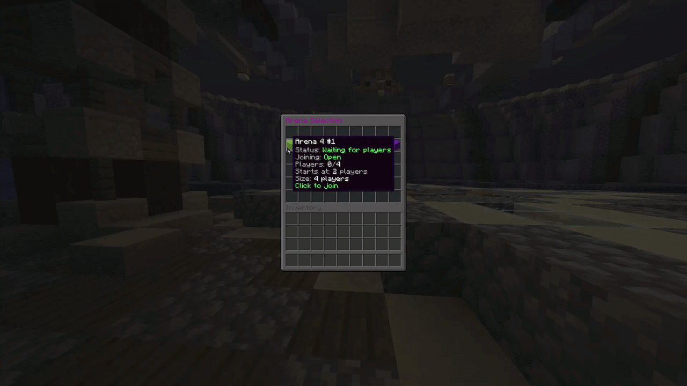

# PillarsMC

A Paper Minecraft minigame plugin where players join pillar arenas, fight with randomized items, and track persistent win/kill statistics.

## Requirements

- Java 21
- Paper server compatible with API version `1.21`
- Maven, if building from source

## Building

```bash
mvn clean package
```

The built plugin jar is created in:

```text
target/pillarsplugin-1.0-SNAPSHOT.jar
```

Copy the jar into your server's `plugins` folder and restart the server.

## Commands

The main command is `/pillars`. The shorter alias `/p` is also available.

| Command | Description |
| --- | --- |
| `/p menu` | Opens the arena selection menu. |
| `/p join <arena>` | Joins a specific arena by config key, for example `/p join arena4_1`. |
| `/p quickjoin` | Joins the best available arena automatically. Alias: `/p joinactive`. |
| `/p leave` | Leaves the current game. |
| `/p forcestart` | Force starts the current game. Requires `pillars.forcestart`. |
| `/p admin` | Opens the admin configuration menu. Requires `pillars.admin`. |
| `/p itemadd <common\|rare\|legendary>` | Adds the held item to an item pool with a sensible default weight. Requires `pillars.admin`. |
| `/p itemadd <common\|rare\|legendary> <weight>` | Advanced item-pool add command with an explicit weight. Requires `pillars.admin`. |
| `/p itemremove <common\|rare\|legendary>` | Disables the held item in an item pool. Requires `pillars.admin`. |
| `/p itemremove <common\|rare\|legendary> <material>` | Advanced item-pool remove command by material name. Requires `pillars.admin`. |

## Permissions

| Permission | Default | Description |
| --- | --- | --- |
| `pillars.forcestart` | `op` | Allows a player to use `/p forcestart`. |
| `pillars.admin` | `op` | Allows a player to use `/p admin`, `/p itemadd`, and `/p itemremove`. |

## Configuration

The plugin creates and reads its settings from:

```text
plugins/PillarsPlugin/config.yml
```

Most gameplay values can be configured in `config.yml`, including countdowns, arena reset timing, border shrinking, item rarity, lobby world, arena worlds, spawn points, per-arena start thresholds, display names, and item cooldowns.

### Main Settings

```yaml
settings:
  beginCountdownSeconds: 5
  endGameLobbyCountdownSeconds: 5
  endGameSpectatorDelayTicks: 40
  arenaResetDelayTicks: 160
  borderShrinkSeconds: 300
  borderMinSize: 1
  lobbyWorldName: "world"
  witherCountdownSeconds: 5
  witherEffectDurationTicks: 40
  witherEffectPeriodTicks: 40
  witherEffectAmplifier: 1
  itemRarity:
    legendaryPercent: 6
    rarePercent: 20
    antiRepeatHistorySize: 4
```

| Setting | Description |
| --- | --- |
| `beginCountdownSeconds` | Countdown duration before a game begins. |
| `endGameLobbyCountdownSeconds` | Countdown before players are sent back to the lobby after a game. |
| `endGameSpectatorDelayTicks` | Delay before end-game spectator handling, in ticks. 20 ticks is about 1 second. |
| `arenaResetDelayTicks` | Delay before the arena is reset, in ticks. |
| `borderShrinkSeconds` | Time before or during world border shrinking, in seconds. |
| `borderMinSize` | Minimum final border size. |
| `lobbyWorldName` | World name used as the lobby destination. |
| `witherCountdownSeconds` | Countdown related to the wither effect phase. |
| `witherEffectDurationTicks` | Wither effect duration, in ticks. |
| `witherEffectPeriodTicks` | How often the wither effect is applied, in ticks. |
| `witherEffectAmplifier` | Strength of the wither effect. |
| `itemRarity.legendaryPercent` | Chance percentage for legendary items. |
| `itemRarity.rarePercent` | Chance percentage for rare items. Common item chance is the remaining percentage. |
| `itemRarity.antiRepeatHistorySize` | Number of recent items remembered per player so rolls avoid giving the same player repeated items. |

### Arenas

Arenas are configured under the `arenas` section. Each arena key, such as `arena4_1`, is also the value used by `/p join <arena>`.

Example:

```yaml
arenas:
  arena4_1:
    worldName: "arena4_1"
    spawnPoints:
      - [-6, 100, -6]
      - [-6, 100, 6]
      - [6, 100, -6]
      - [6, 100, 6]
    displayName: "Arena 4 #1"
    joiningOpen: true
    minPlayers: 2
    itemCooldownSeconds: 5
```

| Arena Field | Description |
| --- | --- |
| `worldName` | Name of the world used for this arena. |
| `spawnPoints` | Player spawn locations in `[x, y, z]` format. The number of spawn points controls the arena capacity. |
| `displayName` | Name shown to players in menus and messages. |
| `joiningOpen` | Whether players can join this arena. Admins can toggle this safely from `/p admin`. |
| `minPlayers` | Minimum players needed for this arena to start automatically. If missing, it defaults to half of the arena capacity. |
| `itemCooldownSeconds` | Cooldown between item grants or item usage for that arena. |

The default config includes:

| Arena Group | Arenas | Players |
| --- | --- | --- |
| 4-player arenas | `arena4_1`, `arena4_2`, `arena4_3` | 4 |
| 8-player arenas | `arena8_1`, `arena8_2`, `arena8_3` | 8 |
| 12-player arenas | `arena12_1`, `arena12_2`, `arena12_3` | 12 |

When adding a new arena, make sure the world exists on the server and that every spawn point is valid for that world.

## Item Pools

Item pools are configured in:

```text
plugins/PillarsPlugin/item-pools.yml
```

The default file is copied from:

```text
src/main/resources/item-pools.yml
```

Example:

```yaml
common:
  STONE: 24
  WOODEN_SWORD: 12
rare:
  ENDER_PEARL: 7
  IRON_SWORD: 5
legendary:
  NETHERITE_SWORD: 1
```

Weights control how likely an item is within its rarity pool. Higher weights are more common. A weight of `0` disables the item.

Rarity chances are controlled separately in `config.yml`:

```yaml
settings:
  itemRarity:
    legendaryPercent: 6
    rarePercent: 20
    antiRepeatHistorySize: 4
```

With the default values, item rolls are 6% legendary, 20% rare, and 74% common. The anti-repeat setting makes the roller retry a few times if a player would receive one of their recent items again.

### Admin Item Editing

Admins can use `/p admin` to open a configuration menu.

The admin menu includes:

| Menu | Description |
| --- | --- |
| Arena Settings | Safely adjusts existing arena minimum players and item cooldowns. |
| Rarity Chances | Adjusts common, rare, and legendary drop percentages. |
| Common Items | Adds or disables common pool items. |
| Rare Items | Adds or disables rare pool items. |
| Legendary Items | Adds or disables legendary pool items. |

Arena settings only expose safe numeric options:

| Setting | Description |
| --- | --- |
| Min Players | Minimum players needed for that arena to start automatically. Clamped between 1 and arena capacity. |
| Item Cooldown | Seconds between item grants in that arena. Minimum 1 second. |
| Joining Open/Closed | Controls whether players can join that arena. Existing players are not kicked. |

Changes from the arena settings menu are saved immediately to `config.yml`.

The arena panel also has runtime-safe controls:

- View current arena status and player count.
- Join a running arena as an admin spectator.
- Close or reopen joining for testing.

Admin spectating does not add the admin as a player. Use `/p leave` to return to the previous location and game mode.

Inside an item pool menu:

- Click `Add Held Item` to add or re-enable the item in your main hand.
- Click an existing item icon to disable it from that pool.
- Use previous and next page buttons when a pool has more items than fit on one screen.
- Use the back button to return to the admin hub.

Commands are also available for quick edits:

```text
/p itemadd rare
/p itemadd rare 8
/p itemremove rare
/p itemremove rare ENDER_PEARL
```

Default item weights used by `/p itemadd <rarity>`:

| Rarity | Default Weight |
| --- | --- |
| common | 10 |
| rare | 5 |
| legendary | 1 |

## HUD And Messages

Players receive clear feedback throughout the game:

- Waiting lobbies show an action bar with current player count and how many more players are needed.
- The sidebar HUD shows the arena status: waiting for players, starting, in progress, ending, or resetting.
- During the game, the action bar shows item delivery time, current zone size, and time until the zone decreases by one block.
- Arena join messages are local to players in that arena.
- Force-start, normal game start, and winner messages are broadcast globally.

## Player Stats

Player stats are saved automatically in:

```text
plugins/PillarsPlugin/stats.json
```

Stats are stored by player UUID. Each player record contains `kills` and `wins`.

Example:

```json
{
  "b744622a-89d2-3677-be4d-addfdb169e9e": {
    "kills": 6,
    "wins": 90
  },
  "0f1e2309-3ba3-3ba8-b90a-5b2a25b198f8": {
    "kills": 0,
    "wins": 2
  }
}
```

The plugin creates `stats.json` if it does not already exist.

## Media

### Admin Menu Overview



### Arena Settings Menu


### Item Pool Editor


### Player Arena Menu



## Project Structure

```text
src/main/java/org/example/pillars
  command/       Command handling for /pillars and /p
  entities/      Arena and player stat models
  gui/           Arena and admin menu GUIs
  listeners/    Bukkit event listeners
  managers/     Game, arena, player, stats, HUD, item, spawn, sound, and teleport logic

src/main/resources
  config.yml     Default plugin configuration
  item-pools.yml Default common, rare, and legendary item pools
  plugin.yml     Plugin metadata, commands, aliases, and permissions
```
